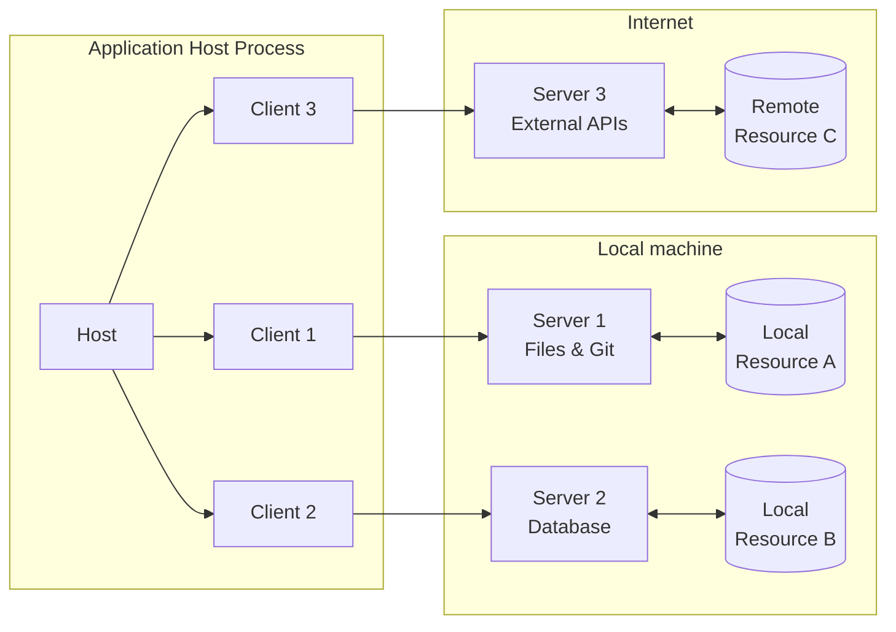
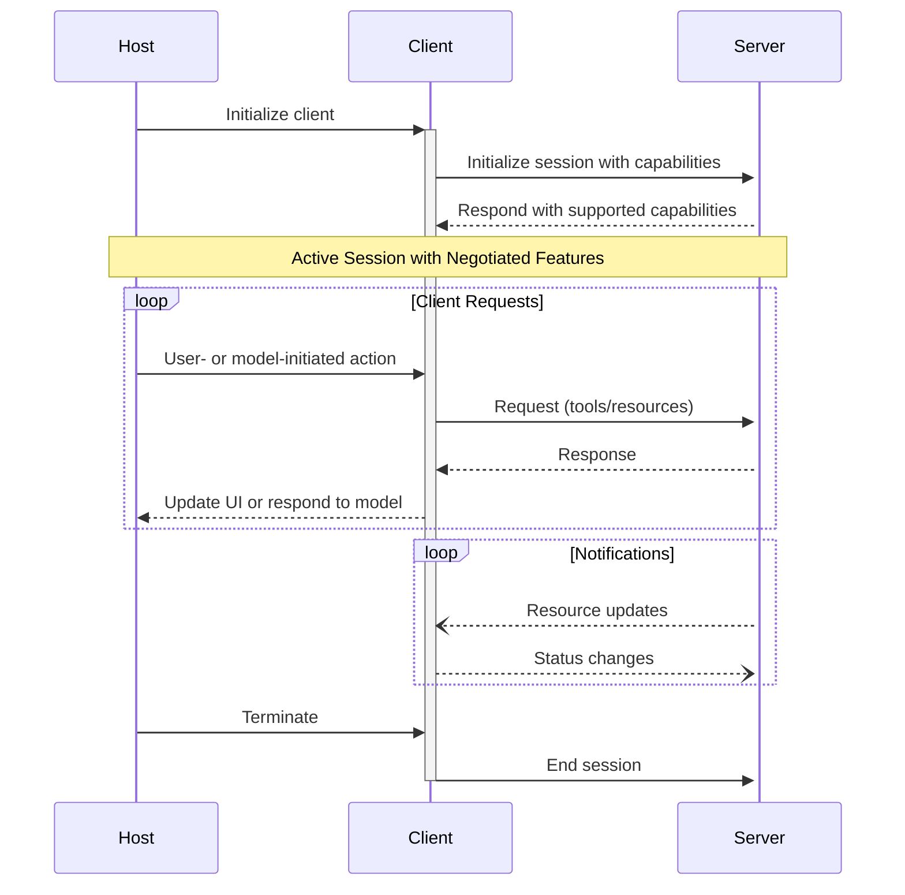
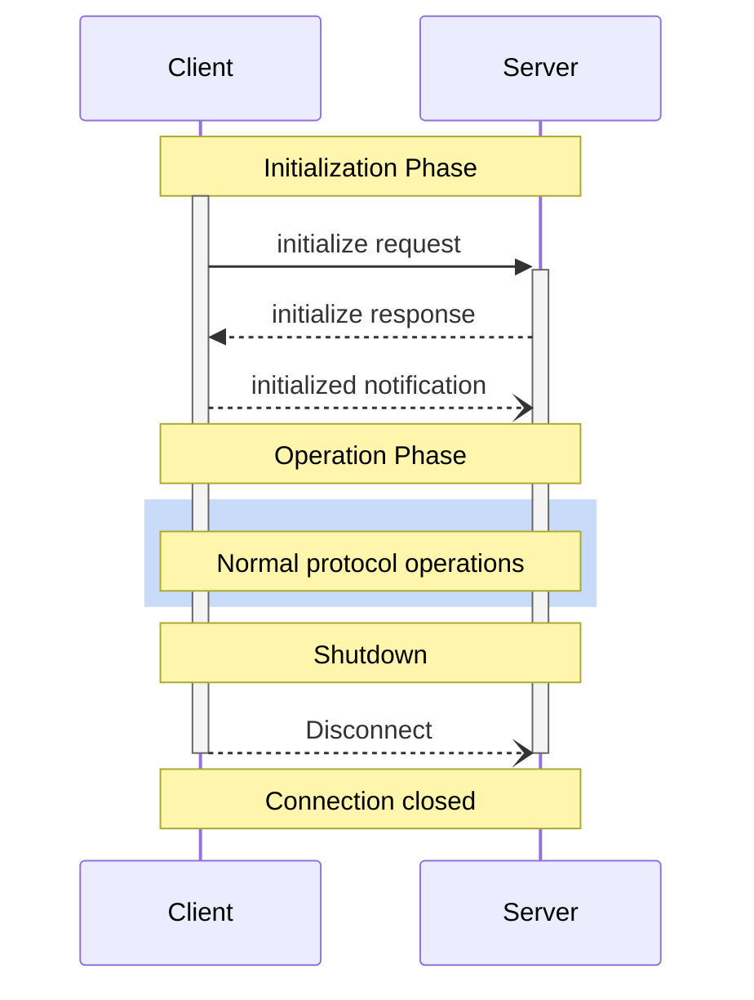

# Model Context Protocol (MCP) Architecture

## Introduction

The Model Context Protocol (MCP) follows a client-host-server architecture that enables users to integrate AI capabilities across applications while maintaining clear security boundaries and isolating concerns. Built on JSON-RPC, MCP provides a stateful session protocol focused on context exchange and sampling coordination between clients and servers.

The protocol consists of several key components that work together:

- **Base Protocol**: Core JSON-RPC message types
- **Lifecycle Management**: Connection initialization, capability negotiation, and session control
- **Authorization**: Authentication and authorization framework for HTTP-based transports
- **Server Features**: Resources, prompts, and tools exposed by servers
- **Client Features**: Sampling and root directory lists provided by clients
- **Utilities**: Cross-cutting concerns like logging and argument completion

All implementations **MUST** support the base protocol and lifecycle management components. Other components **MAY** be implemented based on the specific needs of the application.

## Core Components

### Architecture Overview



### Host

The host process serves as the container and coordinator with the following responsibilities:

- Creates and manages multiple client instances
- Controls client connection permissions and lifecycle
- Enforces security policies and consent requirements
- Handles user authorization decisions
- Coordinates AI/LLM integration and sampling
- Manages context aggregation across clients

### Clients

Each client is created by the host and maintains an isolated server connection:

- Establishes one stateful session per server
- Handles protocol negotiation and capability exchange
- Routes protocol messages bidirectionally
- Manages subscriptions and notifications
- Maintains security boundaries between servers

A host application creates and manages multiple clients, with each client having a 1:1 relationship with a particular server.

### Servers

Servers provide specialized context and capabilities:

- Expose resources, tools and prompts via MCP primitives
- Operate independently with focused responsibilities
- Request sampling through client interfaces
- Must respect security constraints

## Design Principles

### 1. Simple Server Implementation

- Host applications handle complex orchestration responsibilities
- Servers focus on specific, well-defined capabilities
- Simple interfaces minimize implementation overhead
- Clear separation enables maintainable code

### 2. High Composability

- Each server provides focused functionality in isolation
- Multiple servers can be combined seamlessly
- Shared protocol enables interoperability
- Modular design supports extensibility

### 3. Security and Isolation

- Servers receive only necessary contextual information
- Full conversation history stays with the host
- Each server connection maintains isolation
- Cross-server interactions are controlled by the host
- Host process enforces security boundaries

### 4. Progressive Feature Addition

- Core protocol provides minimal required functionality
- Additional capabilities can be negotiated as needed
- Servers and clients evolve independently
- Protocol designed for future extensibility
- Backwards compatibility is maintained

## Capability Negotiation

The protocol uses a capability-based negotiation system where clients and servers explicitly declare their supported features during initialization:



### Capability Features

- Servers declare capabilities like:
  - Resource subscriptions
  - Tool support
  - Prompt templates
- Clients declare capabilities like:
  - Sampling support
  - Notification handling
- Both parties must respect declared capabilities throughout the session
- Additional capabilities can be negotiated through protocol extensions

## Implementation Notes

### Security Considerations

- Server isolation prevents access to full conversation context
- Host controls all cross-server interactions
- Clear security boundaries between components
- Capability negotiation ensures feature compatibility

### Best Practices

- Implement clear capability declarations
- Handle server lifecycle appropriately
- Maintain proper error handling
- Clean up resources on session end
- Follow protocol versioning guidelines

## Protocol Base

- Built on JSON-RPC 2.0
- Provides stateful session management
- Enables standardized context exchange
- Supports sampling coordination
- Maintains backwards compatibility

## Message Types

All messages between MCP clients and servers **MUST** follow the JSON-RPC 2.0 specification. The protocol defines these types of messages:

### Requests

Requests are sent from the client to the server or vice versa, to initiate an operation.

```typescript
{
  jsonrpc: "2.0";
  id: string | number;
  method: string;
  params?: {
    [key: string]: unknown;
  };
}
```

- Requests **MUST** include a string or integer ID
- The ID **MUST NOT** be `null`
- The request ID **MUST NOT** have been previously used by the requestor within the same session

### Responses

Responses are sent in reply to requests, containing the result or error of the operation.

```typescript
{
  jsonrpc: "2.0";
  id: string | number;
  result?: {
    [key: string]: unknown;
  }
  error?: {
    code: number;
    message: string;
    data?: unknown;
  }
}
```

- Responses **MUST** include the same ID as the request they correspond to
- Responses are categorized as either **successful results** or **errors**
- Either a `result` or an `error` **MUST** be set, but not both
- Results **MAY** follow any JSON object structure
- Errors **MUST** include an error code and message at minimum
- Error codes **MUST** be integers

### Notifications

Notifications are sent as one-way messages. The receiver **MUST NOT** send a response.

```typescript
{
  jsonrpc: "2.0";
  method: string;
  params?: {
    [key: string]: unknown;
  };
}
```

- Notifications **MUST NOT** include an ID

## Connection Lifecycle

The protocol defines a rigorous lifecycle for client-server connections that ensures proper capability negotiation and state management:

1. **Initialization**: Capability negotiation and protocol version agreement
2. **Operation**: Normal protocol communication
3. **Shutdown**: Graceful termination of the connection



### Initialization Phase

The initialization phase **MUST** be the first interaction between client and server. During this phase:

1. Client sends `initialize` request containing:
```json
{
  "jsonrpc": "2.0",
  "id": 1,
  "method": "initialize",
  "params": {
    "protocolVersion": "2024-11-05",
    "capabilities": {
      "roots": {
        "listChanged": true
      },
      "sampling": {},
      "elicitation": {}
    },
    "clientInfo": {
      "name": "ExampleClient",
      "title": "Example Client Display Name", 
      "version": "1.0.0"
    }
  }
}
```

2. Server responds with its capabilities:
```json
{
  "jsonrpc": "2.0",
  "id": 1,
  "result": {
    "protocolVersion": "2024-11-05", 
    "capabilities": {
      "logging": {},
      "prompts": {
        "listChanged": true
      },
      "resources": {
        "subscribe": true,
        "listChanged": true
      },
      "tools": {
        "listChanged": true
      }
    },
    "serverInfo": {
      "name": "ExampleServer"
    }
  }
}
```

This phase establishes:
- Protocol version compatibility
- Exchange and negotiation of capabilities

## Client Features

### Sampling

The protocol provides a standardized way for servers to request LLM sampling ("completions" or "generations") from language models via clients. This enables:

- Servers to leverage AI capabilities without requiring API keys
- Support for text, audio, or image-based interactions 
- Optional inclusion of MCP server context in prompts

#### User Interaction Model

Sampling in MCP allows servers to implement agentic behaviors by enabling LLM calls to occur _nested_ inside other MCP server features.

**Security Considerations:**

For trust & safety and security, implementations **SHOULD**:
- Always have a human in the loop with ability to deny sampling requests
- Provide UI for easy review of sampling requests
- Allow users to view and edit prompts before sending
- Present generated responses for review before delivery

#### Sampling Protocol

1. Clients must declare sampling capability during initialization:
```json
{
  "capabilities": {
    "sampling": {}
  }
}
```

2. Servers can request sampling via `sampling/createMessage`:
```json
{
  "jsonrpc": "2.0",
  "id": 1,
  "method": "sampling/createMessage",
  "params": {
    "messages": [
      {
        "role": "user",
        "content": {
          "type": "text",
          "text": "What is the capital of France?"
        }
      }
    ],
    "modelPreferences": {
      "hints": [
        {
          "name": "claude-3-sonnet"
        }
      ],
      "intelligencePriority": 0.8,
      "speedPriority": 0.5
    },
    "systemPrompt": "You are a helpful assistant.",
    "maxTokens": 100
  }
}
```

## Authorization

### Overview

The Model Context Protocol provides authorization capabilities at the transport level, enabling MCP clients to make requests to restricted MCP servers on behalf of resource owners. Authorization is **OPTIONAL** for MCP implementations.

### Protocol Requirements

When authorization is supported:

- HTTP-based transport implementations **SHOULD** conform to this specification
- STDIO transport implementations **SHOULD NOT** follow this specification (use environment credentials instead)
- Alternative transport implementations **MUST** follow established security best practices

### Standards Compliance

The authorization mechanism is based on these specifications:
- OAuth 2.1 IETF DRAFT
- OAuth 2.0 Authorization Server Metadata
- OAuth 2.0 Dynamic Client Registration Protocol
- OAuth 2.0 Protected Resource Metadata

### Authorization Flow

1. Authorization servers **MUST**:
   - Implement OAuth 2.1 with appropriate security measures
   - Support at least one discovery mechanism:
     - OAuth 2.0 Authorization Server Metadata
     - OpenID Connect Discovery 1.0

2. MCP servers **MUST**:
   - Implement OAuth 2.0 Protected Resource Metadata
   - Use WWW-Authenticate header for 401 responses
   - Include authorization_servers field in metadata

3. MCP clients **MUST**:
   - Support both discovery mechanisms
   - Parse WWW-Authenticate headers
   - Handle HTTP 401 responses appropriately

## Server Features

Servers provide three fundamental primitives for adding context to language models:

### 1. Prompts
- Pre-defined templates/instructions guiding LLM interactions
- User-controlled through slash commands or menu options
- Interactive templates invoked by user choice

### 2. Resources
- Structured data/content providing additional context
- Application-controlled contextual data
- Examples: File contents, git history
- Client manages attachment and management

### 3. Tools
- Executable functions allowing models to perform actions
- Model-controlled functions
- Examples: API requests, file operations
- Enables LLMs to take concrete actions

Control Hierarchy:

| Primitive | Control                | Description                                        | Example                         |
| --------- | ---------------------- | -------------------------------------------------- | ------------------------------- |
| Prompts   | User-controlled        | Interactive templates invoked by user choice       | Slash commands, menu options    |
| Resources | Application-controlled | Contextual data attached and managed by the client | File contents, git history      |
| Tools     | Model-controlled       | Functions exposed to the LLM to take actions       | API POST requests, file writing |
